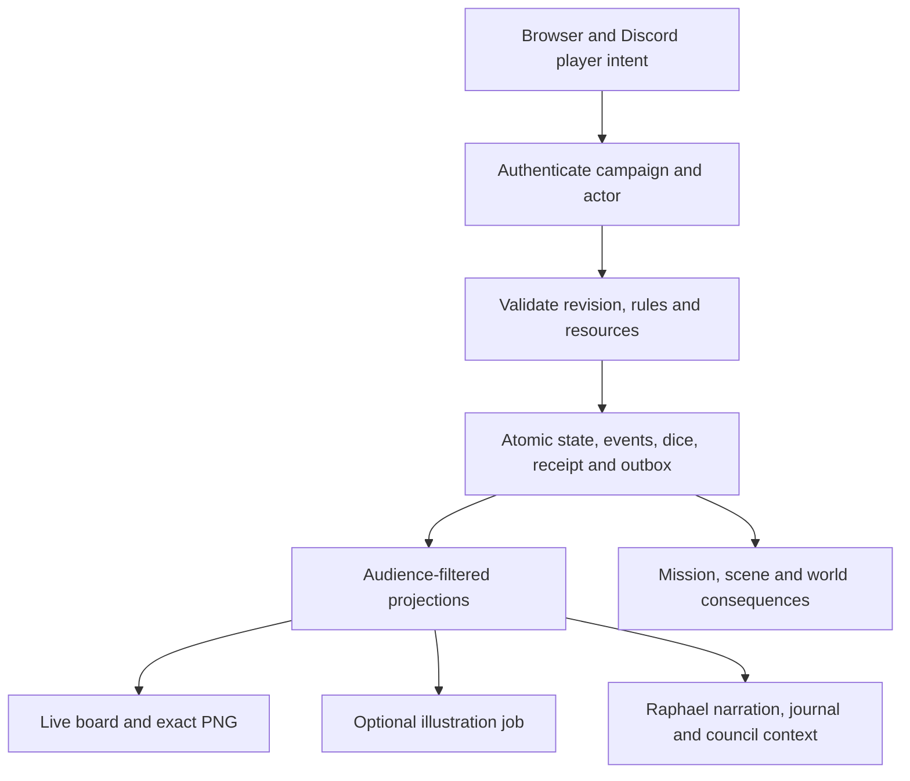

# Raph full-system tactical implementation plan

Updated 2026-09-06 for the request to plan these features into the full Raph system. This consolidated roadmap supersedes the earlier planning checkpoints in this file. It changes planning documentation only. Historical implementation and test evidence remains in [RAPH_INTEGRATION_PROGRESS.md](RAPH_INTEGRATION_PROGRESS.md); no new runtime verification or deployment is claimed here.

## Intended player experience

Players enter one persistent campaign through Discord or Raph's browser interface. They can browse discovered world and regional maps, enter the current mission scene, move their character, resolve actions, inspect effects and saved rolls, ask Raphael for counsel, and complete a debrief. Both interfaces operate on the same campaign state.

The live board updates after every committed movement step, action, reaction and effect change. **Show current map** returns a precise map image whenever requested, including outside combat, outside the player's turn, and while paused. **Illustrate this view** requests optional generated artwork of what that player can currently observe, including after any move or action. Neither request spends a game action or rerolls dice.

The main screen contains the map, scene navigation, turn order, movement and action resources, character information, action controls, effects, roll history, mission journal, Raphael counsel and the council. On narrow screens the board and action controls remain accessible while the other panels open on demand. Discord remains a complete play interface rather than merely a link to the browser.

## Reference and evidence boundaries

The supplied [Forge launch page](https://forge-vtt.com/launch/thewargodaries) returned a public loading shell through agent-reach's Jina Reader backend. Its private tactical board was not inspected. The plan therefore implements the requested VTT experience without claiming a visual match to an unseen private session.

Foundry's official scene model provides a useful reference: world and regional maps and encounter scenes, an active scene distinct from an individual user's viewed scene, configurable grids and backgrounds, permissions, token vision and stored exploration. Raph will adapt those concepts to its own campaign services. This is a design inference, not a claim of existing Forge integration. [Foundry scene documentation](https://foundryvtt.com/article/scenes/).

The current workspace has substantial partial implementation. Graph inspection identifies tactical geometry and rendering, character-backed checks, browser scene controls and Discord image/adventure adapters. Prior progress records also describe persistent game commands, revision delivery, scene transitions, mission consequences, council, content loading and backups. Implementation must reconcile those records with focused tests before calling any feature complete; this plan does not reclassify code presence as release readiness.

## Integration boundaries

| Raph component | Reuse and finish |
| --- | --- |
| `raphael-council/game/store.mjs`, `http.mjs`, `storage.mjs` | Authoritative commands, membership, revision checks, transactions, action receipts, event history and audience projections. |
| `raphael-council/characters/`, `game/checks.mjs`, `game/character-info.mjs` | Approved character imports, pinned combat profiles, required-stat validation, checks/saves and player-visible roll breakdowns. |
| `raphael-council/maps/grid.mjs`, `maps/render.mjs` | Shared octagonal geometry, legal paths, footprints, visibility and deterministic map images. Extend the existing renderer instead of creating separate Discord geometry. |
| `raphael-council/game/` scene, content, world and council services | Persistent destinations, entrances, mission choices, world consequences, debrief and authored content. Preserve the existing reviewed departure boundary. |
| `raphael-council/app/` and game API routes | A unified campaign screen using authenticated services, ordered updates, reconnect history and image requests. Audit root-screen integration against current source before replacing anything. |
| `raphael-council/discord/` | Equivalent owner-bound actions, pending rolls, effects, mission controls and private map delivery, using the same game services. |
| `raphael-council/images/`, `app/scene-images.tsx` | Existing approved references, image jobs, request deduplication and source-revision tracking. Precise snapshots remain available without a generation provider. |
| `RAPH_INTEGRATION_PROGRESS.md`, `PERSISTENT_WORLD_PLAN.md`, `WORLD_STORY_FRAMEWORK.md` | Existing implementation evidence, setting, player agency, knowledge boundaries and campaign continuity. |

These are responsibility boundaries, not an instruction to perform a large module rewrite. Extract rules or combat-timing modules only where implementation needs a coherent, testable contract. Do not build another game engine inside either client.

## Shared state and action flow

A command contains campaign, actor, action, targets or route, expected revision and a unique request ID. Identity comes from the authenticated session. The service checks membership, ownership, turn, costs, visibility and supported rules before committing anything.

One transaction saves the resulting state, events, dice, spent resources, command receipt and delivery work. A repeated request returns its saved result. A stale or invalid request changes nothing. Replaying history and retrying map delivery never generate dice or apply damage again. Use serialized campaign writes and versioned schemas.

Pin the approved character snapshot and rules version used by an action. Reimporting a sheet cannot silently heal an actor or reset current resources. Missing or conflicting combat data needs an explicit correction or reviewed rule choice before a dependent action is accepted.

AI may translate an intent into a structured proposal and describe a saved outcome. Game services alone commit positions, dice, damage, resources, effect clocks and mission outcomes. Ambiguous costly actions use an actor-owned preview. Factual narration and all five council contributions use bounded, audience-filtered evidence; the player retains the final mission choice.

## Maps and octagonal tactics

Connect world → region → location/floor → encounter with stable IDs. Distinguish viewing a discovered map from moving the party to it. Scene travel uses reviewed entrances and carries current HP, resources and applicable effects. Returning to a scene restores its casualties, changed terrain, doors, objects and discoveries. Travel time is an explicit campaign event.

Regular octagons alone do not tile a plane. Use playable octagons with small non-playable square fillers, integer column/row coordinates and eight logical movement neighbors. Display coordinates as A1, B1 and so on, including multi-letter columns for larger maps. Diagonal connections cross fillers; fillers never hold tokens.

The initial explicit house rule is five feet per neighboring step, including diagonals. Difficult terrain and supported height changes add their declared costs. Block corner cutting and validate the whole footprint of large creatures. Path previews, movement, range and area templates must use the same geometry policy. Define occupied-cell passage separately from stopping.

The tactical presentation should provide reachable-cell highlights, a route and cost preview, target ranges, elevation labels, cover indicators and a clear active-token outline. Begin with top-down rendering; an optional isometric camera can use the same coordinates later. Retain the selected D&D initiative/action rules. A separate Final Fantasy-style speed or charge-time system would be a later explicit rules variant.

Flying, climbing, jumping, forced movement, opportunity attacks, cover and elevation require declared support in the rules matrix. An unsupported action must explain what is missing before spending resources.

Filter hidden geometry, actors, effects and background assets before sending data to a client or image service. CSS fog over a complete secret map is insufficient. Persist player discovery separately from current line of sight, and distinguish remembered terrain from currently visible creatures. Private vision must not enter a public Discord attachment or cache entry.

## Rolls and applicable statistics

Use the campaign's approved 2024 character data and a versioned rules adapter. Build a supported-rules matrix with source, required character fields, automatic modifiers, resource costs, visibility and independent fixtures for each action type.

Each roll receipt records:

- Actor, owner, campaign, request, event and revision identifiers.
- Roll purpose, ability/skill/weapon or feature, targets and rules version.
- Raw dice, kept and discarded dice, and advantage/disadvantage sources.
- Every applied modifier with its source and pinned character version.
- Total, authorized outcome, resource expenditure and linked damage/effect events.

Determine ability, proficiency or expertise, equipment bonuses, temporary effects and other adjustments from structured rules and approved data. Never infer an uncertain proficiency from a class name or add a bonus twice. Keep attack, damage, save, check, initiative and death-save policies distinct. Verify their exact behavior against primary authorized rules during implementation.

Show a readable breakdown such as `14 on the die + 3 ability + 2 proficiency = 19`, with expandable sources. This is an illustrative arithmetic example, not an automatically applicable bonus. Keep secret DCs and enemy statistics private. A manual roll, when supported, must be clearly marked and adjudicated through its own permission policy.

Complete the current checks/attacks foundation with initiative, action-specific saves, resources and supported features. Rolls requested by a spell or hazard link back to the pending action so resolving one check can apply its consequence exactly once. Players can browse their saved rolls without changing game state; public sharing follows an explicit visibility policy.

A pause/resume cycle must preserve a pending reviewed roll's approved statistics, original revision and fingerprint. Resume may refresh the displayed revision only after the authoritative event ledger proves that every intervening revision exists and contains only pause/resume events. Missing history or any intervening action, movement, effect or profile change invalidates the old request. Paused play cannot consume the roll, and receipt replay never rolls again. Bounded client history is not authority for this decision.

## Combat timing and lingering effects

Use a persisted encounter state machine: setup → initiative → start-of-turn effects → movement/actions → reaction windows when needed → end-of-turn effects → next actor → encounter completion. Recheck defeat and completion at the rules-defined boundaries, including after lethal effects.

Evaluate movement cell by cell. A reaction, terrain event or hazard may interrupt a route before its destination. Persist the remaining route and pending choices so a restart cannot skip the interruption or repeat already applied damage. A reaction timeout, if introduced, must be an explicit campaign policy rather than an accidental network timeout.

An effect needs stable identity, source actor/event, targets or affected cells, visibility, mechanical changes, trigger, repeat limit, stacking policy, concentration owner where applicable, duration/expiry anchor and removal reason. Support entry, turn start, turn end and action-linked triggers according to the actual rule. Expiry may refer to a specific actor's turn, a number of rounds or campaign time; do not treat them as interchangeable counters.

Render visible zones with patterns and labels. Render actor conditions with named badges. The details panel states what triggers the effect, its observable consequences and when it ends, for example “expires at the end of Mira's next turn.” Use color as a supplementary cue. Hidden mechanical effects reveal only their authorized manifestations.

Test repeated entry, overlapping zones, start/end ordering, stacking, saves, concentration loss, dispels, source removal, defeat, pause and leaving/revisiting scenes. Pause freezes game time. Combat-to-exploration transitions explicitly convert or retain duration anchors. Chronos and development heartbeats never advance game turns.

## Automatic maps and image generation

| Product | Trigger and behavior |
| --- | --- |
| Live tactical board | Ordered updates after every committed movement step and resolved action, reaction, damage or effect event. Browser animation interpolates saved positions only. |
| Exact tactical PNG | Available through Show current map at any time and used for combat image delivery. It renders the authorized saved coordinates, tokens, zones and labels. |
| Illustrated view | Available after any movement/action and on demand. The existing image service receives the visible scene and approved art references, then returns revision-labeled artwork. |

The exact snapshot is the immediate gameplay image. Image generation supplies backgrounds and illustrative views; it does not redraw the mechanical truth on every turn. Geometry, token positions, hit points and effect coverage remain structured data regardless of what generated art depicts.

Cache by campaign, scene, state revision, audience/visibility revision, renderer version and art version. Recheck authorization before delivery. A delayed illustration remains associated with its source revision and is labeled historical when necessary; it cannot overwrite a newer current view.

The browser catches up through bounded ordered revisions after disconnect. Discord edits an authorized bound board within platform delivery limits and may coalesce intermediate image deliveries, while retaining every event for history. Individual vision uses private maps. Shared maps contain only shared-authorized information. Retry delivery without repeating play.

Provider outages leave exact maps and actions usable. Repeated identical illustration requests reuse a job where appropriate. Do not require a paid image job for each combat step. Image requests do not grant additional counsel or reveal hidden narrative context.

## Campaign, council and authored content

A council choice leads to a reviewed mission and prepared destination. Party entry commits scene transition and mission activation together. Keep the existing departure contract stable; this plan does not call for another departure system.

Encounter completion updates objectives, casualties and other declared consequences once. Debrief derives from those committed outcomes and cannot apply them again. Journal entries reference saved events and authorized facts. Both browser and Discord display the same mission, council choice and world tracks.

Load authored world/region/location/scene/mission records through schema validation, with GM-only plans separated from player projections. Start with one complete Greyharbor chain: arrival/briefing → tactical encounter → next scene → debrief → consequential council choice. Expand Behind the Veil only after its blueprint has been converted into reviewed runtime content. Preserve approved art, consent and existing player-agency boundaries.

## Implementation work cards

The order below completes the remaining contracts while reusing partial implementations. Each card starts with a bounded audit of its current code and tests; retain passing capabilities instead of rebuilding them.

| Order | Work and primary boundary | Acceptance gate |
| --- | --- | --- |
| 1. Establish the supported baseline | Reconcile game, character, map, image, browser and Discord capabilities with progress records. Publish the rules matrix and versioned state contracts. Verify migration and membership behavior. | A documented two-player fixture identifies every supported action and gap. Repeat/stale/unauthorized commands and restart behavior are demonstrated with saved receipts. |
| 2. Close the player map loop | Finish ordered updates, exact PNGs, scene browsing, reach/route previews, effects display, saved-roll navigation and image requests from one authenticated player session. | Two players see matching authorized revisions after a multi-cell move and action. A refresh works while paused; reconnect catches up; a delayed image cannot replace the current board. |
| 3. Complete supported rolls and combat timing | Extend structured profiles, initiative, saves, resources, reactions, concentration and effect timing. Link pending rolls to their action consequences. | Independent rule fixtures show correct raw dice and modifiers. Restart during a reaction and retry its resolution without extra rolls, movement, damage or spent resources. Effects expire at the correct boundary and update the map. |
| 4. Deliver the authored mission chain | Use existing scene/content/departure services for reviewed entrances, persistent revisits, objectives, approved art and mission consequences. | Play two connected scenes, return after restart, and retain HP, casualties, terrain, discovery and continuing effects. Mission completion and debrief each apply their intended changes once. |
| 5. Finish the full Raph interface | Connect campaign navigation, characters, journal, Raphael narration/counsel and five-member council to authoritative projections in browser and Discord. | Both interfaces agree on mission and player choices. Narration describes the recorded rolls and cannot mutate mechanics or expose GM plans. Keyboard coordinates and text alternatives support play without precise pointer use. |
| 6. Prove recovery and release readiness | Coordinate game, character, image and asset backups; migrations and revision reconciliation; persistent Node hosting and a bounded authenticated multiplayer acceptance session. | Import two characters, play combat with an interruption and lingering effect, request both image types, reconnect, restart, travel and debrief. Restore into a clean location without replaying actions or losing character/art references. |

Cards 2 and 3 should be developed against a single repeatable encounter so the map, roll and timing paths are verified together. Proposed feedback target: own accepted actions update locally immediately after the server response, and another connected browser catches up within the normal update interval. Measure actual latency under the chosen host; do not present a target as an existing service guarantee.

The release host must support the current Node, SQLite, filesystem and native rendering requirements with persistent storage. An edge-only host is not automatically compatible. Preserve existing databases and approved assets. Back up before migrations; restore rehearsals use a separate location. Any prototype-save migration must be explicit and reviewed, with receipt and resource semantics preserved.

The recovery audit found that game-only backups omit the separate character and image databases and art assets. Rolling back only the game can leave newer character approvals that no longer match an actor's pinned sheet and newer image projections that reveal facts beyond the restored checkpoint. Runtime lifecycle ownership must therefore supply one coordinated checkpoint: prevent concurrent writes, capture all stores plus required renders/art/provenance, and write the complete manifest last. Restore into unused locations and verify pinned character versions and game-history identity before activation. Independent online snapshots or equal numeric revisions do not establish a coherent recovery point.

Recovery acceptance must advance from game revision R/character V1 to a later game/character V2/image, then restore R/V1 without exposing the later facts. Fresh checks must use the restored approved statistics, and retained receipt IDs must return their original dice. Missing assets, corrupt or mismatched stores, incomplete manifests and interrupted image/import jobs each need an explicit tested outcome.

## Requested skill roles

| Skill/tool | Role in this plan |
| --- | --- |
| Agent-reach | Fetch the supplied reference and current primary rules/platform documentation. Jina Reader was used for the Forge URL; research evidence remains distinct from game authority. |
| Figma design-to-code | When a concrete Figma node is provided, read its design context first and adapt it to Raph's real components and services. No node was supplied, so this planning task does not claim Figma implementation. |
| Ghidra reverse engineering | Analyze a specific authorized compiled integration if one becomes necessary. No binary was supplied; the existing source-based integration does not need decompilation. |
| Chronos | Optional development supervision, separate from gameplay. The installation preflight found the curated 0.9.2 source with no source conflict; cache inspection is not proof of active supervision. No recurrence is created by this plan. |
| Image generation | Approved scene/background art and optional per-action illustrations. Deterministic rendering supplies exact tactical snapshots. |

These skills guide development; players do not need them installed to use Raph. Planning their roles does not make them runtime dependencies.

## Completion definition and next implementation slice

The full feature is complete when two authenticated players can enter an authored mission, move on the octagonal board, resolve the published supported actions with saved modifier breakdowns, see lasting effects and updated maps, request an illustration after any action, survive disconnect/restart, revisit persistent scenes and complete a debrief that changes the world once. Browser and Discord must agree. Publish remaining unsupported mechanics rather than treating a limited attack engine as complete 2024 D&D support.

The next implementation slice is a bounded audit and completion of one 12-by-12 encounter using two approved characters, one enemy, blocked terrain, an entry hazard and a turn-timed effect. Demonstrate move → hazard → saved attack/check → updated map → optional illustration request → end turn/effect → restart → identical saved state across both interfaces. Build the later rules, mission chain and release work on that verified path.
