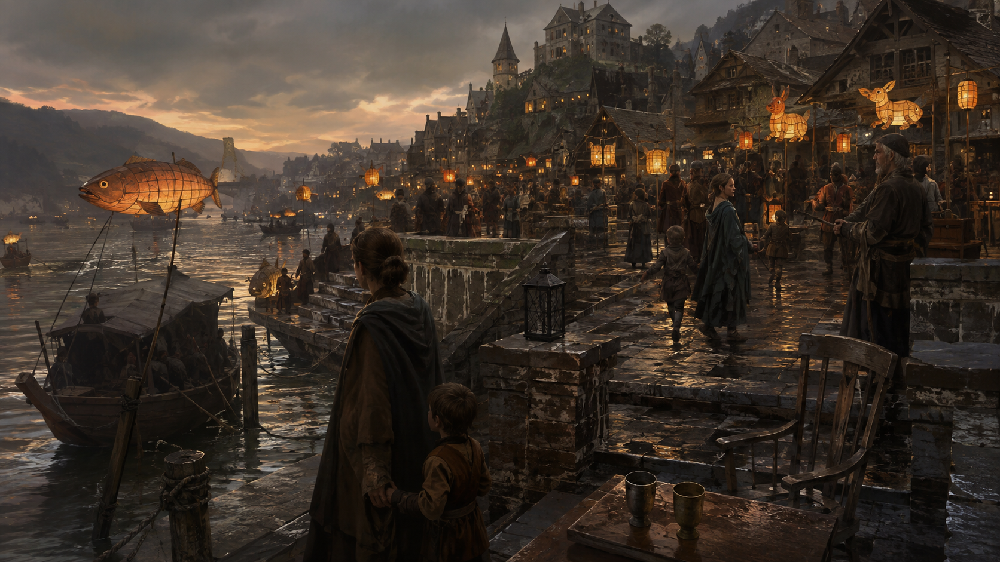
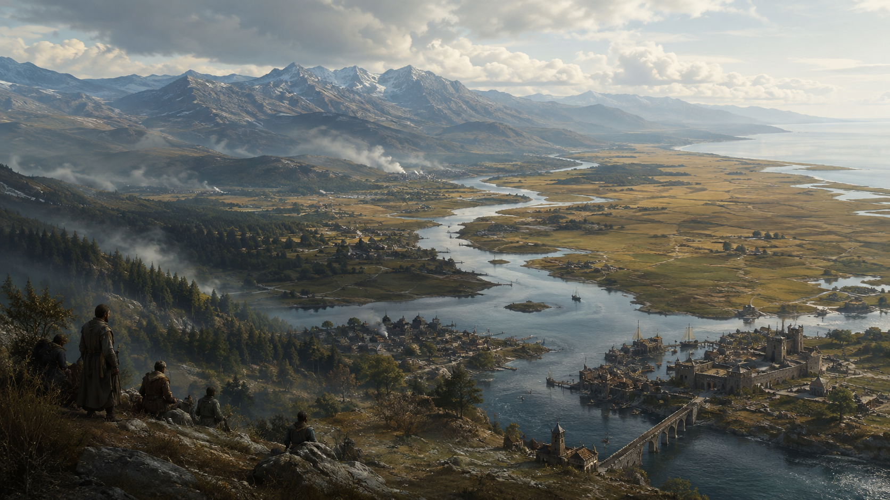

# Witnesslight — campaign and world artwork

Ultra-realistic D&D illustration with dramatic light, restrained ornament, and detail where the story needs it.

| Collection | Images | Open |
| --- | ---: | --- |
| The story campaign | 18 | [Greyharbor, the Lantern Reach, and Nareth](IMAGE_INDEX.md) |
| The world of Avarra | 24 | [Rivers, cities, wilderness, islands, and lands beyond the current story](world/WORLD_INDEX.md) |
| The recurring cast | 14 | [Character portraits for Greyharbor, the Reach and Nareth](people/PEOPLE_INDEX.md) |
| Life and lore | 10 | [Factions, creatures, important objects and quiet moments](lore/LORE_INDEX.md) |

**66 images across four collections.** [Open the searchable gallery](gallery.html) to filter by collection, name and subject. GM previews and conditional outcomes start hidden. Check the party's current knowledge before showing an image.

The world expansion distinguishes established location foundations from new visual concepts. Exact visual geography is interpretive; imagined lands and unchosen outcomes do not become played canon. See the [world collection guide](world/README.md) for continuity and how to revise images after player choices.

Exact prompts and asset records: [story manifest](manifest.json) · [world manifest](world/manifest.json) · [portrait manifest](people/manifest.json) · [lore manifest](lore/manifest.json).

[Coverage against the campaign](COVERAGE.md) · [How to update art after player choices](README.md#updating-art-after-player-choices).
