# Witnesslight image index

GM collection: later-location images can contain spoilers. Share individual images after checking party knowledge. These 18 images are narrative establishing art; outcomes remain governed by play. See README.md for style continuity and updates after choices.

## greyharbor

Reveal category: opening

## last hearth

Reveal category: opening

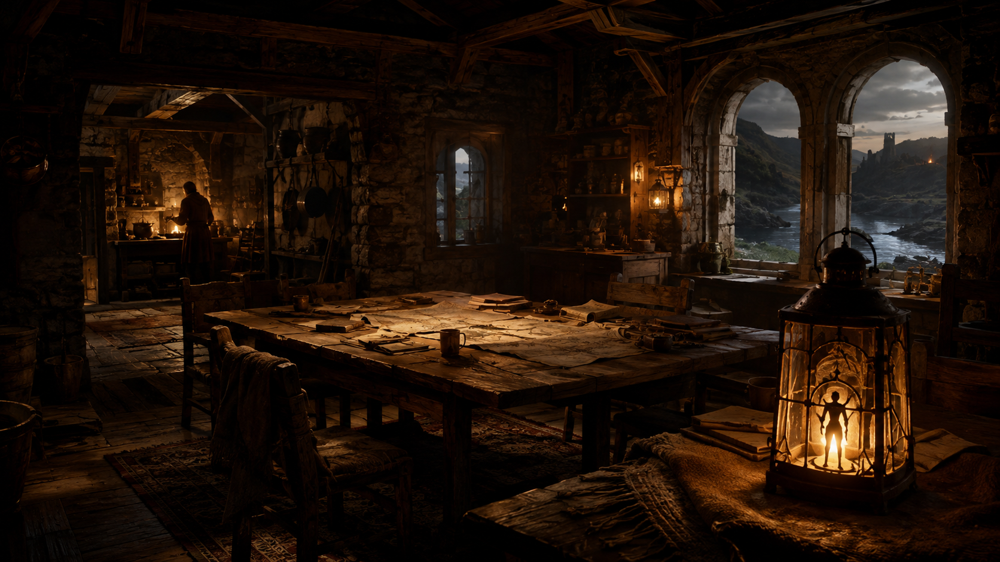

## bellweather weir

Reveal category: on-discovery

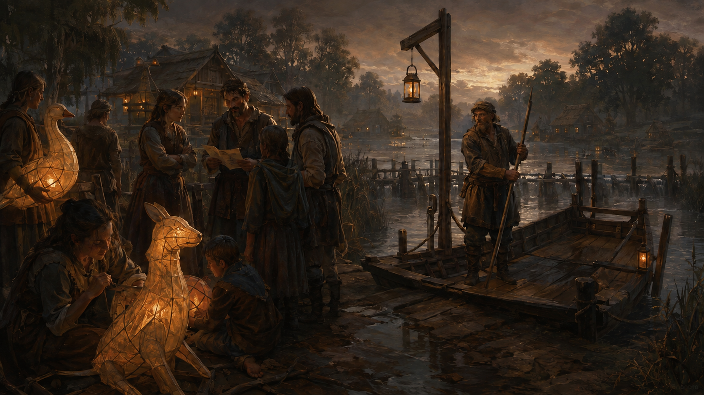

## sunken archive

Reveal category: on-discovery

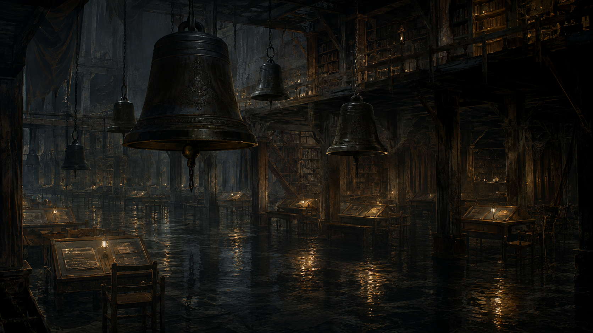

## ember crossing

Reveal category: on-discovery

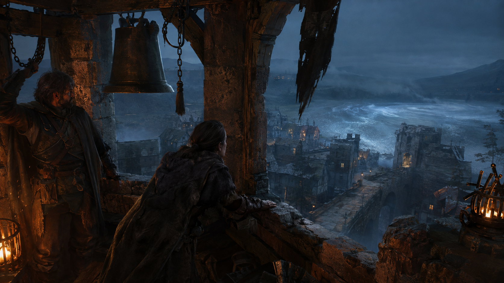

## festival returning lights

Reveal category: opening

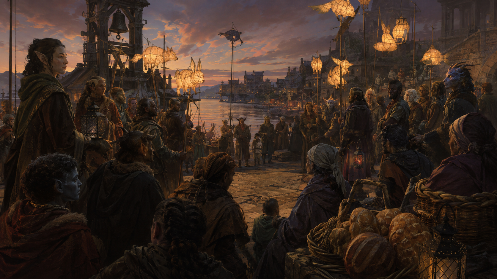

## thornwake

Reveal category: on-discovery

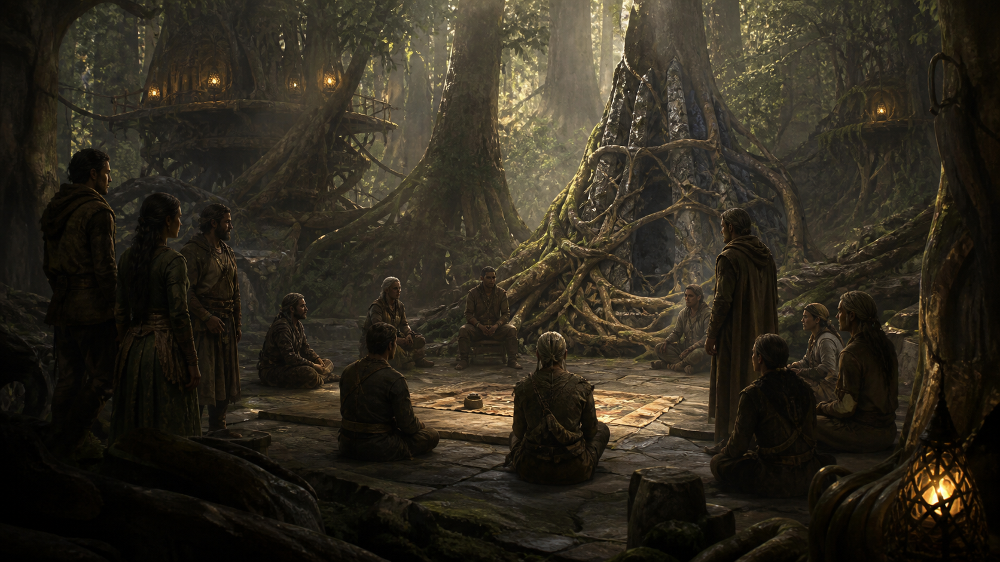

## glassmere

Reveal category: gm-spoilers

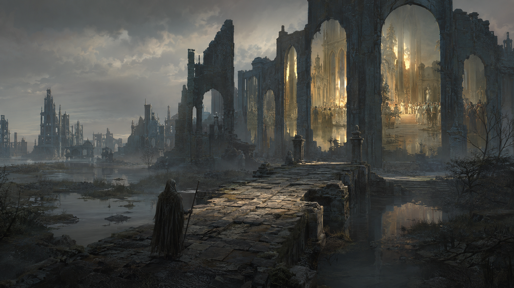

## pale between

Reveal category: gm-spoilers

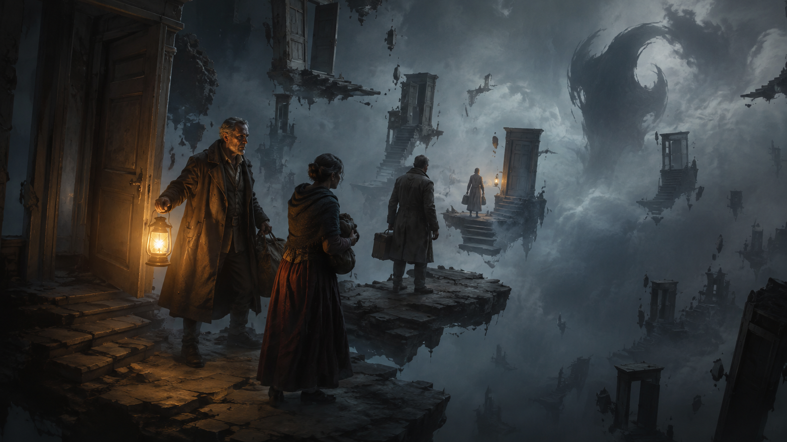

## witness vault

Reveal category: gm-spoilers

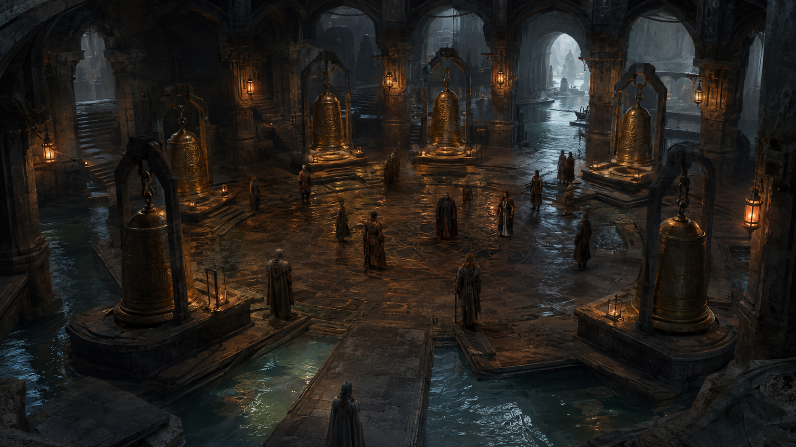

## saltglass shore

Reveal category: on-discovery

## drowned abbey

Reveal category: on-discovery

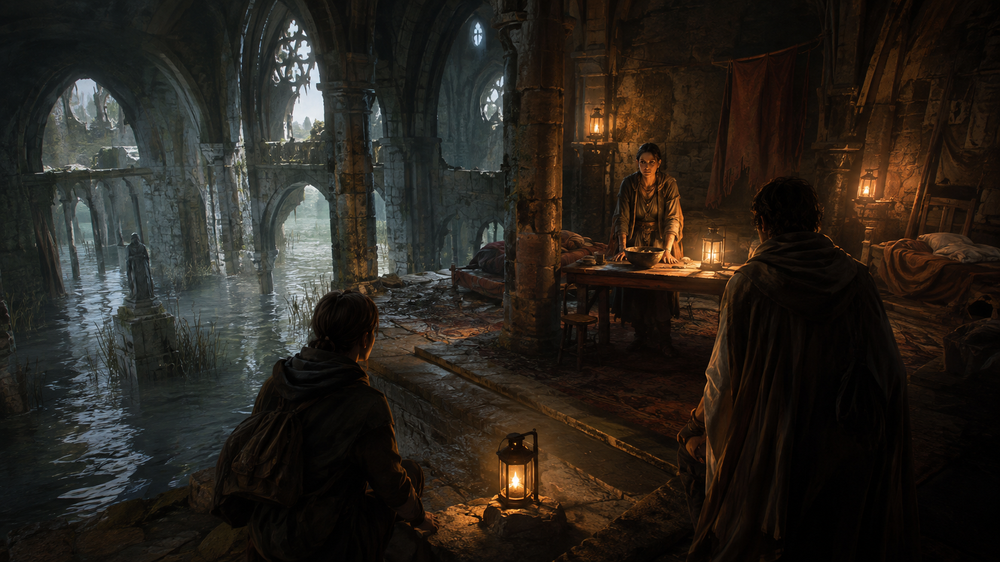

## reedmarket

Reveal category: on-discovery

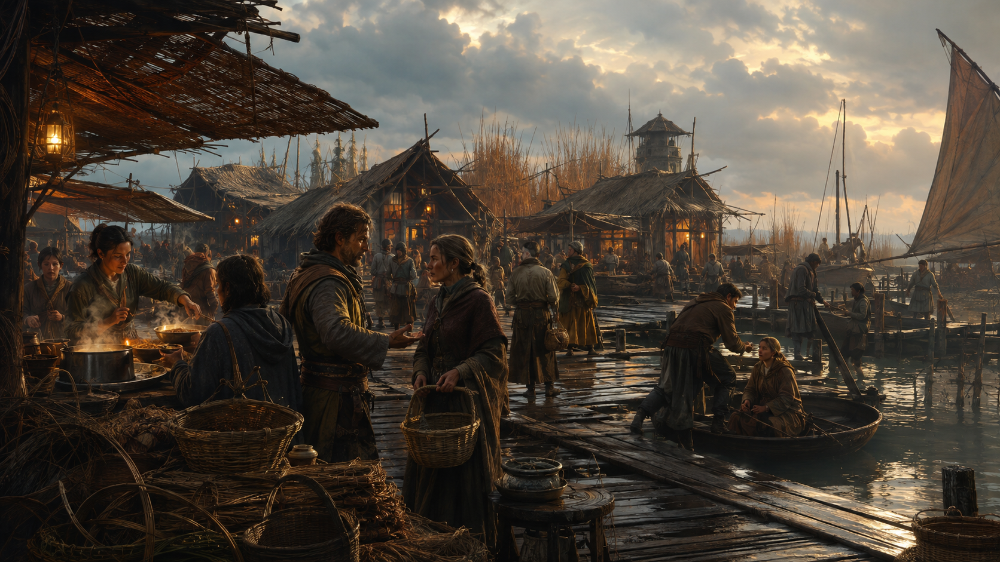

## cinderworks

Reveal category: on-discovery

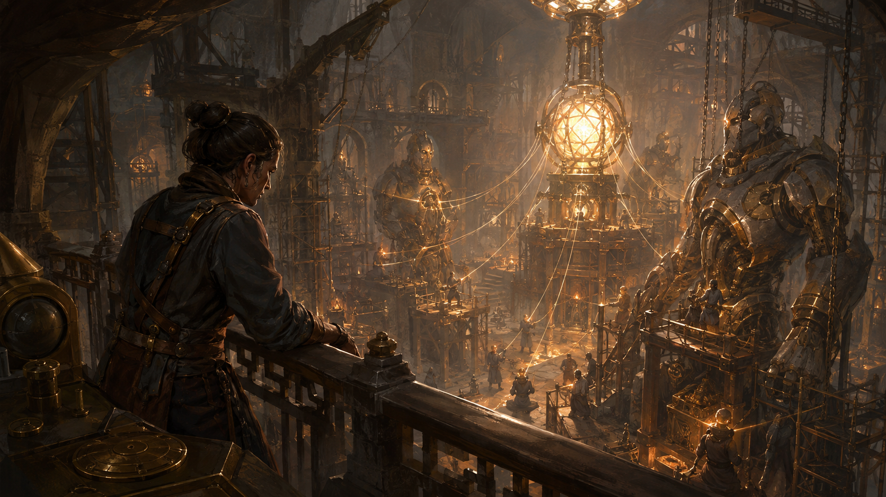

## watchspire

Reveal category: on-discovery

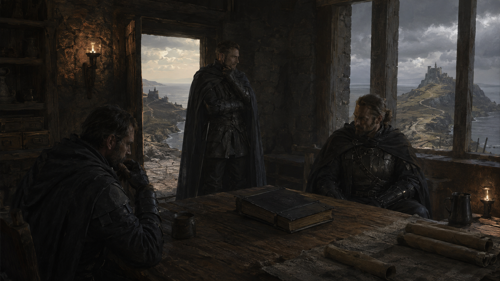

## hollow choir

Reveal category: on-discovery

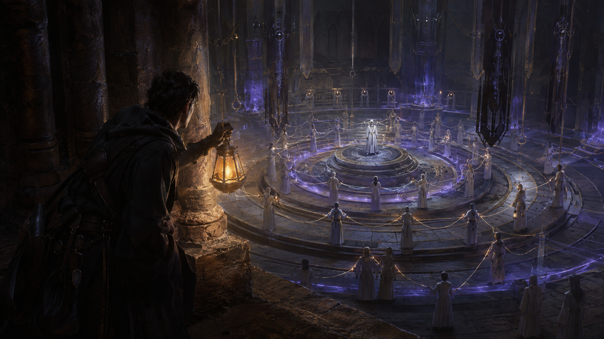

## crownfast

Reveal category: on-discovery

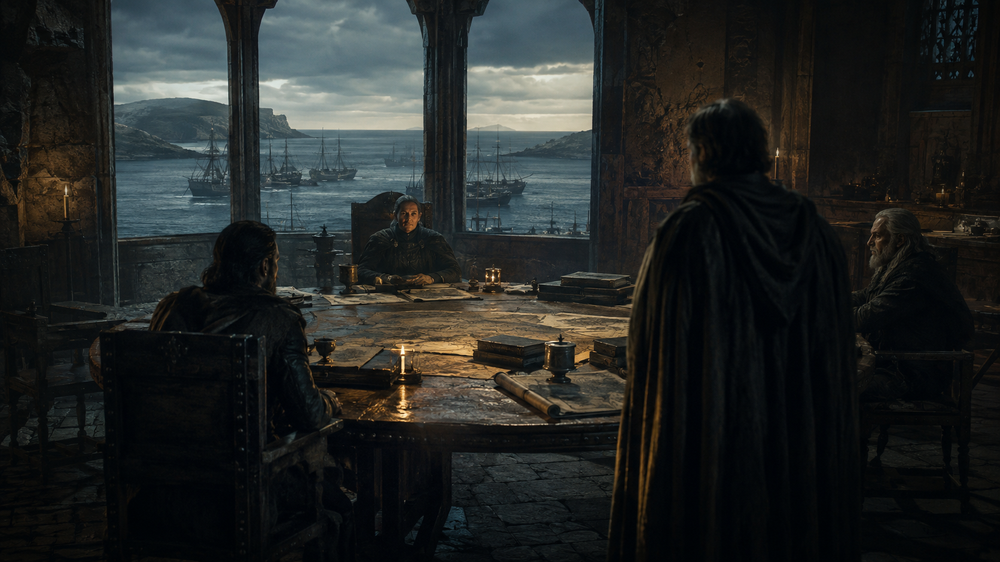

## homecoming

Reveal category: conditional

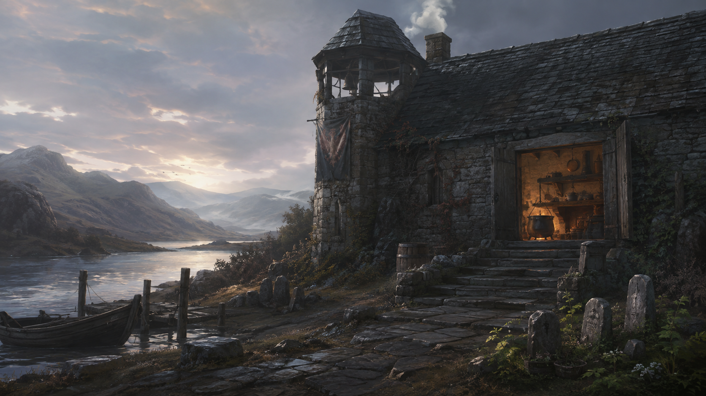

