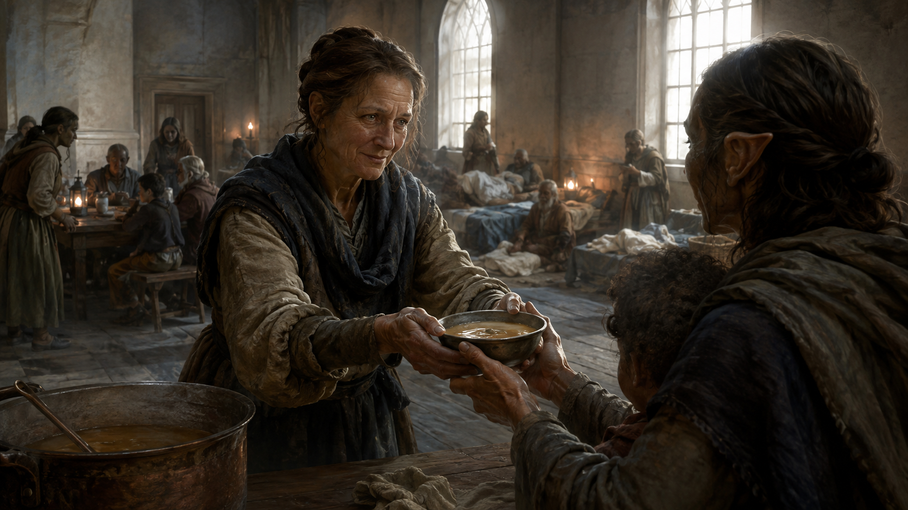
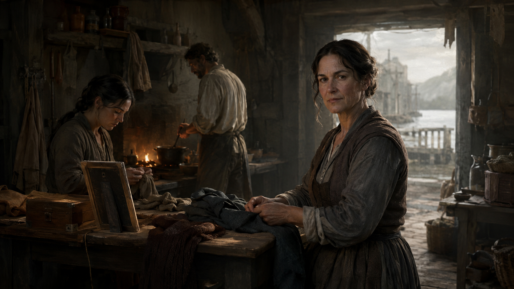
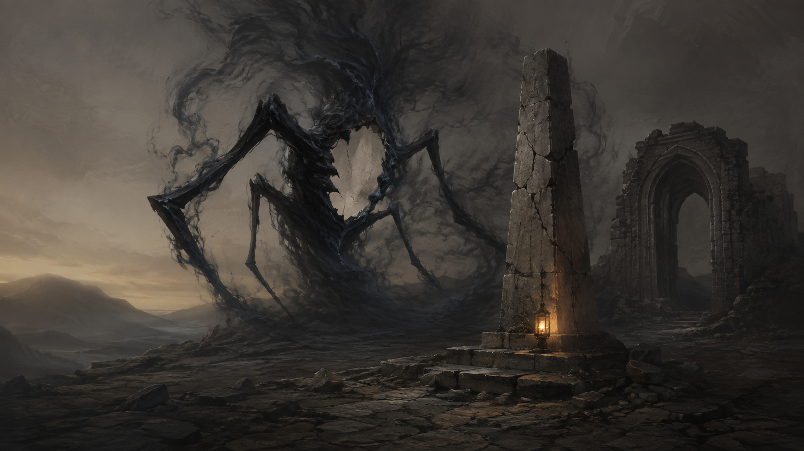
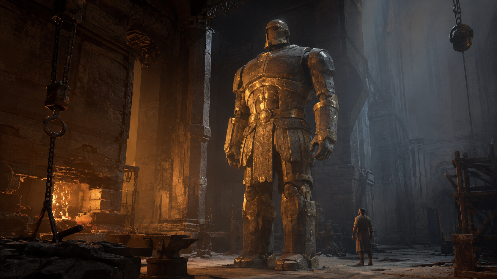
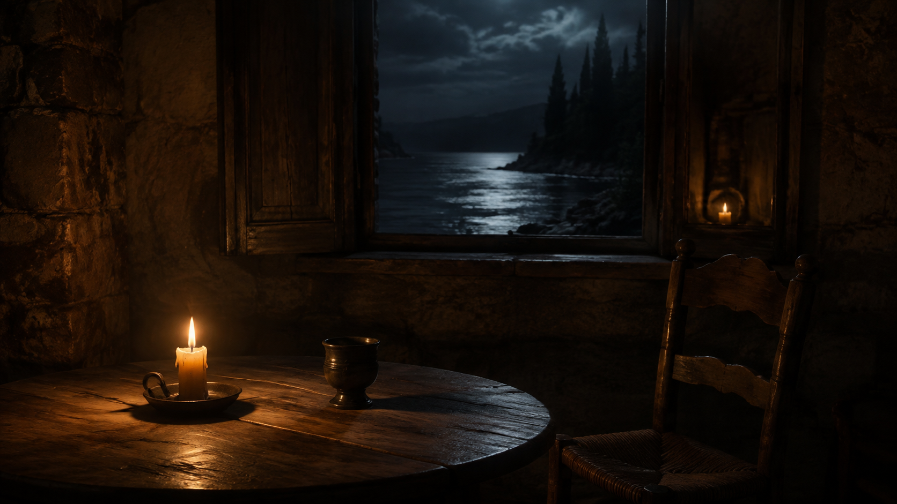
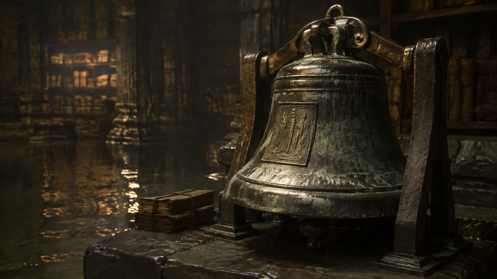
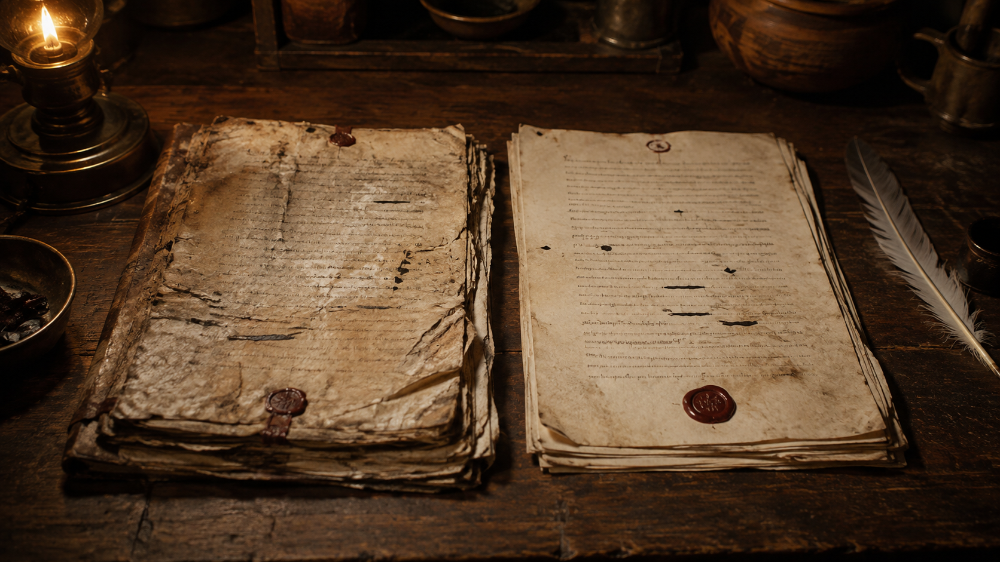
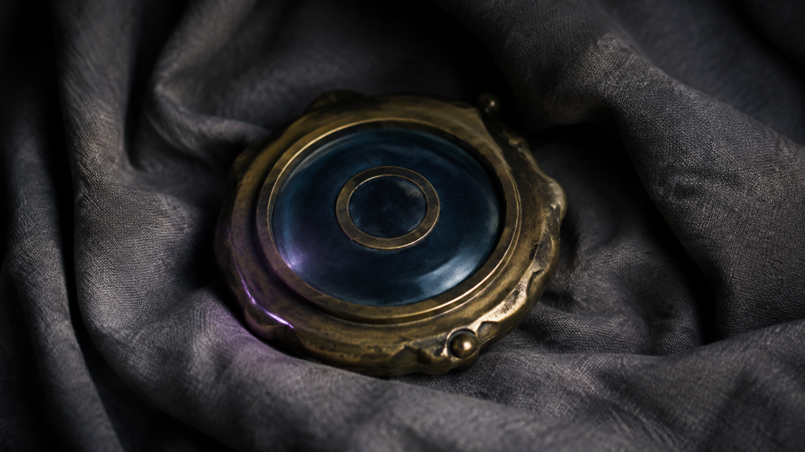
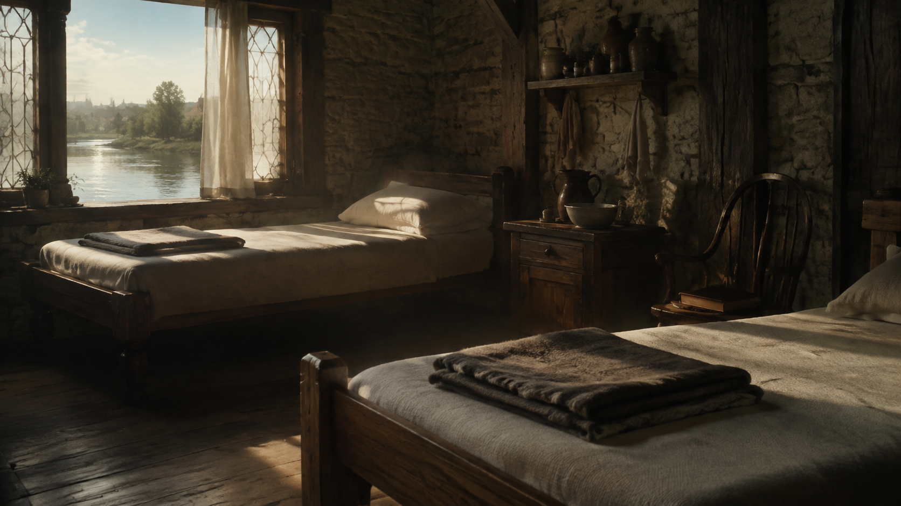
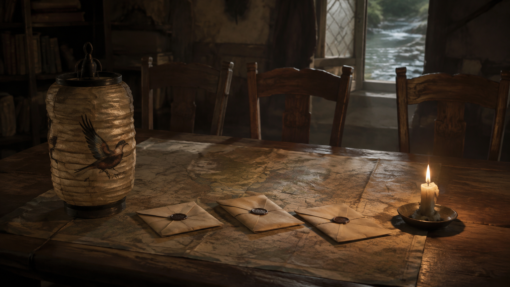

# Witnesslight — life, creatures and story objects

10 narrative illustrations to support encounters, investigation and quieter moments. Showing an image does not decide an encounter or its outcome.

[Searchable gallery](../gallery.html) · [Full collection](../COLLECTION_INDEX.md) · [Use and continuity](README.md) · [Exact prompts](manifest.json)

## 57 — A Quiet Ministry refuge

**Reveal after the relevant discovery.** A Quiet Ministry refuge. Scene art, with no predetermined outcome. Review discoveries before revealing.

## 58 — Lives of the Unwritten

**GM preview until discovered.** Lives of the Unwritten. Scene art, with no predetermined outcome. Review discoveries before revealing.

## 59 — A Hollow at the breach

**Reveal after the relevant discovery.** A Hollow at the breach. Scene art, with no predetermined outcome. Review discoveries before revealing.

## 60 — A Cinderworks war construct

**Reveal after the relevant discovery.** A Cinderworks war construct. Scene art, with no predetermined outcome. Review discoveries before revealing.

## 61 — Raphael's counsel through light

**Reveal after the relevant discovery.** An optional experience of Raphael through quiet light. Preserve the personal manifestation chosen by each player; this image establishes no universal form.

## 62 — The bronze witness bell

**Reveal after the relevant discovery.** The bronze witness bell. Scene art, with no predetermined outcome. Review discoveries before revealing.

## 63 — The contested civic record

**GM preview until discovered.** The contested civic record. GM preview until the evidence is discovered. Decorative ink marks are unreadable mood art, not a playable evidence handout.

## 64 — A keyed channel seal

**Reveal after the relevant discovery.** A keyed channel seal. Scene art, with no predetermined outcome. Review discoveries before revealing.

## 65 — Rest at the Last Hearth

**Reveal after the relevant discovery.** Rest at the Last Hearth. Scene art, with no predetermined outcome. Review discoveries before revealing.

## 66 — The first dark lantern

**Reveal after the relevant discovery.** The first dark lantern. Scene art, with no predetermined outcome. Review discoveries before revealing.

