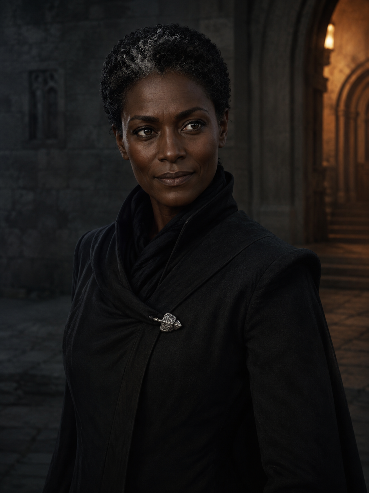
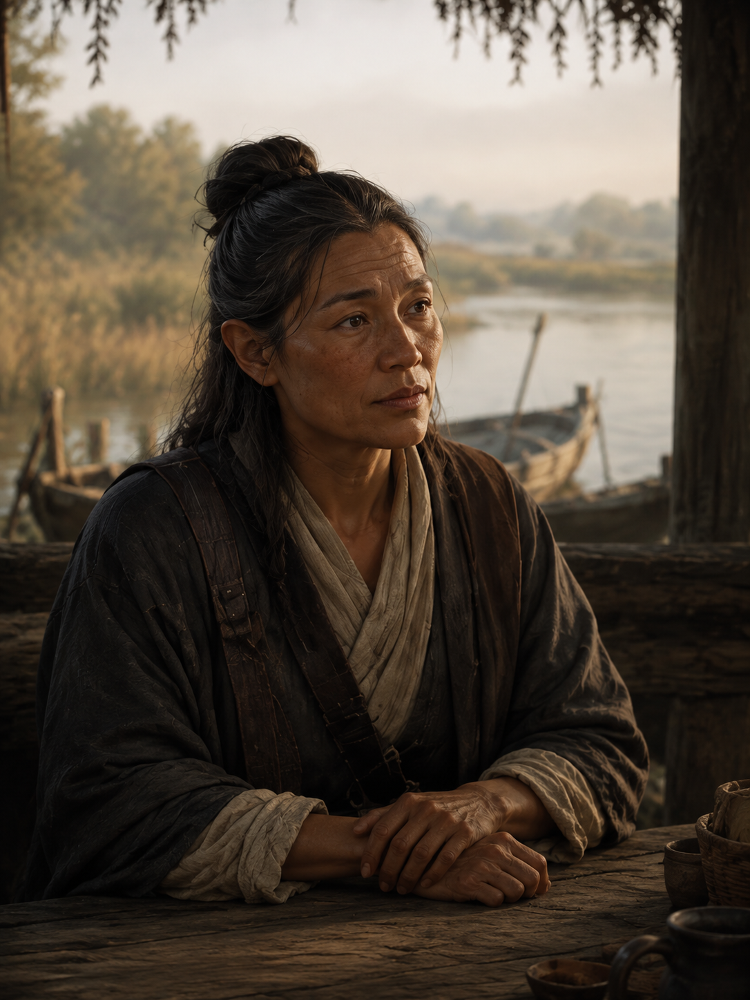
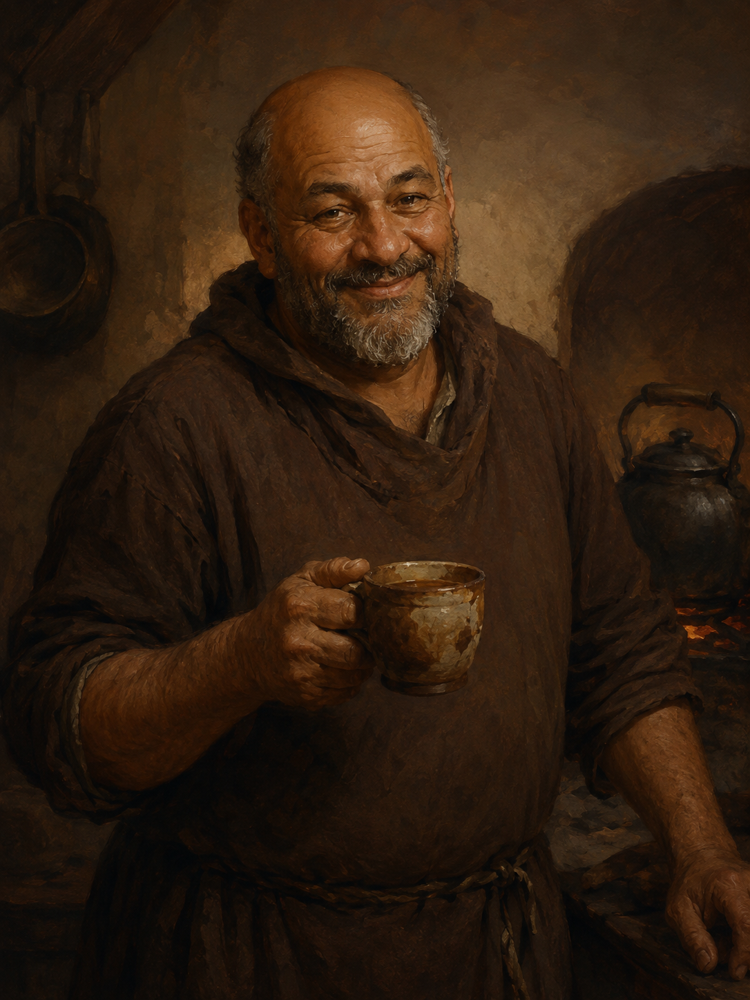
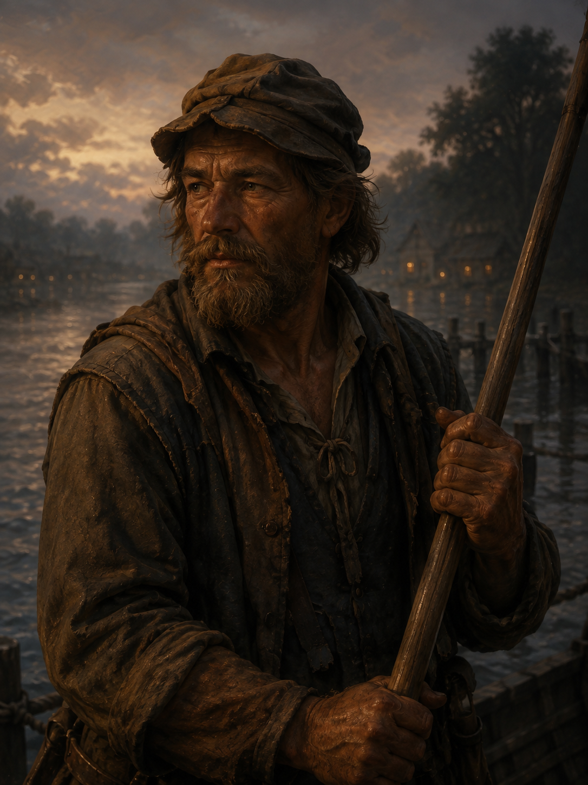
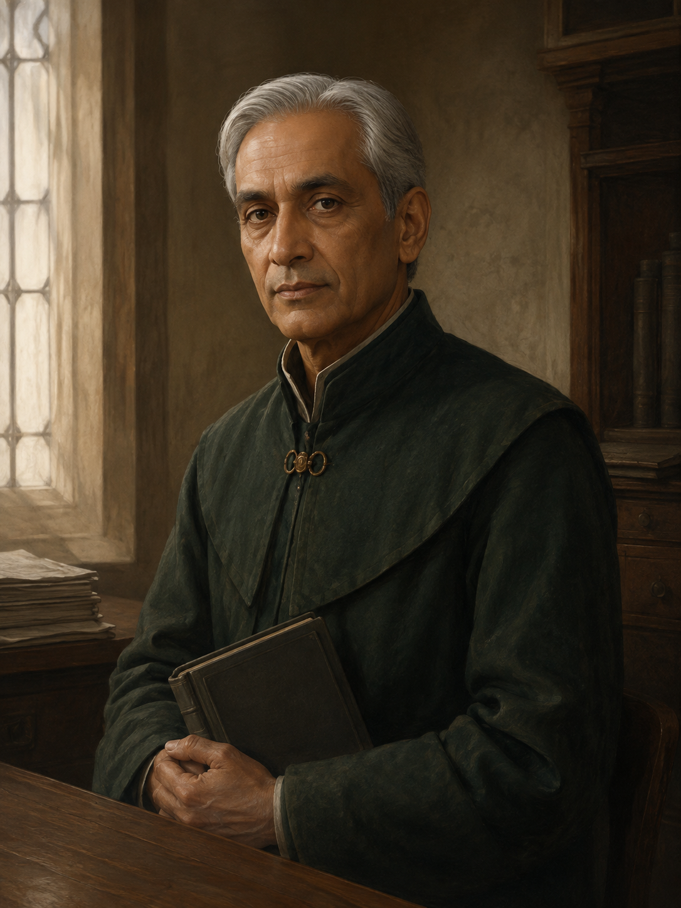
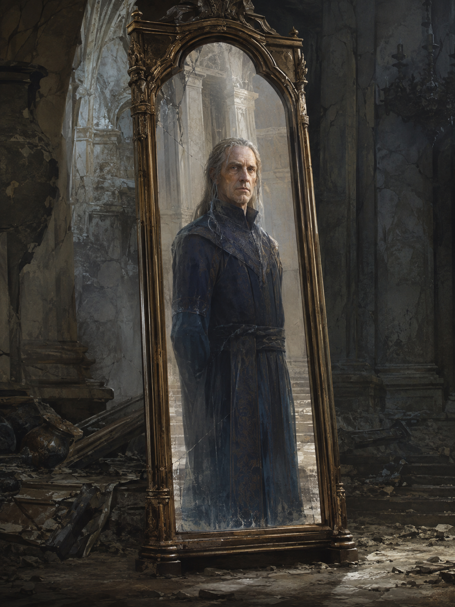
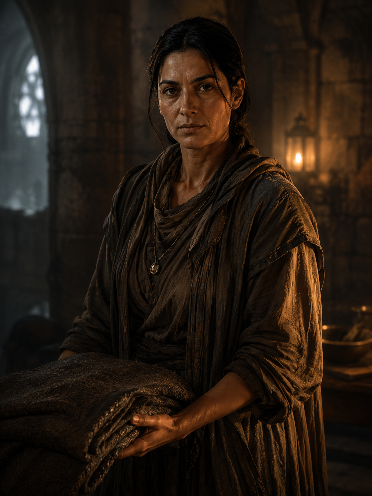
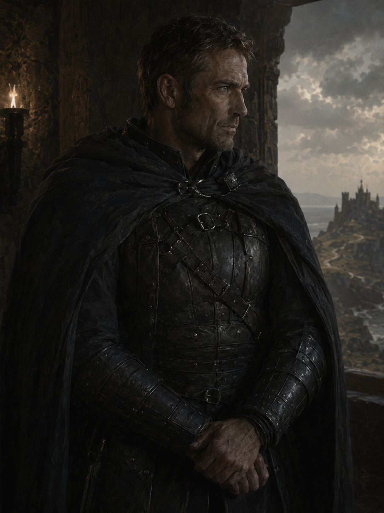
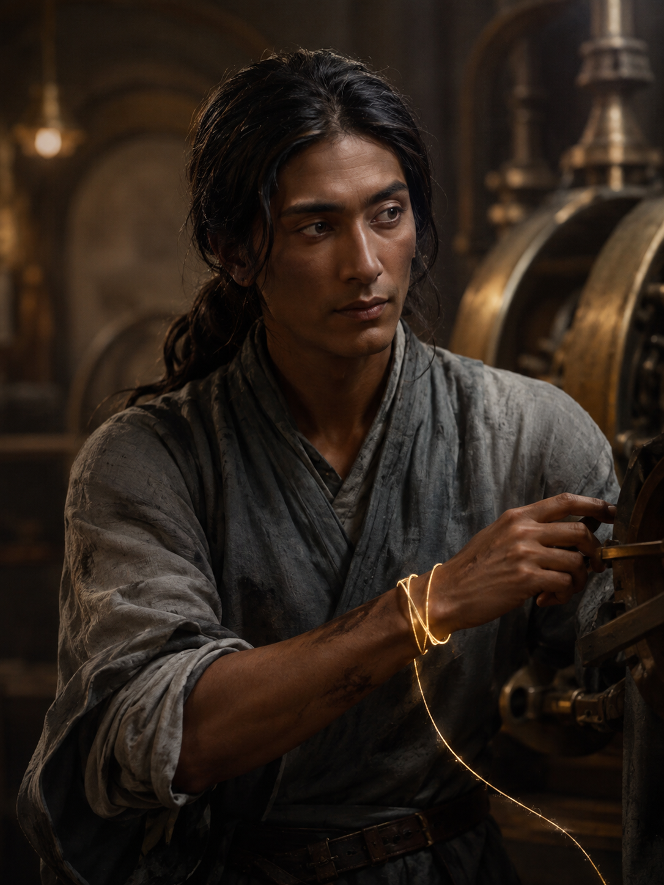
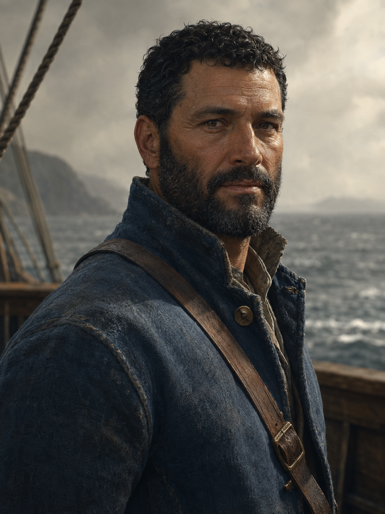

# Witnesslight — the people of Avarra

14 recurring-character portraits for Greyharbor, the Lantern Reach and Nareth. Edran's image reveals his preserved nature and belongs in the GM collection until discovered.

[Searchable gallery](../gallery.html) · [Full collection](../COLLECTION_INDEX.md) · [Continuity guide](README.md) · [Exact prompts](manifest.json)

## 43 — Lysa the Lantern-Keeper

**Reveal after introduction and review of visible details.**

## 44 — Oren Vale

**Reveal after introduction and review of visible details.**

## 45 — Sable of the Court

**Reveal after introduction and review of visible details.**

## 46 — Nera Venn

**Reveal after introduction and review of visible details.**

## 47 — Mirelle Dain

**Reveal after introduction and review of visible details.**

## 48 — Brother Halden

**Reveal after introduction and review of visible details.**

## 49 — Tavin

**Reveal after introduction and review of visible details.**

## 50 — Provost Elian Rook

**Reveal after introduction and review of visible details.**

## 51 — Edran Voss — the Hollow Regent

**GM preview until discovered.**

## 52 — Mara Venn

**Reveal after introduction and review of visible details.**

## 53 — Captain Rusk

**Reveal after introduction and review of visible details.**

## 54 — Engineer Ilyan Sere

**Reveal after introduction and review of visible details.**

## 55 — Captain Elian Ward

**Reveal after introduction and review of visible details.**

## 56 — Maelor Voss

**Reveal after introduction and review of visible details.**

